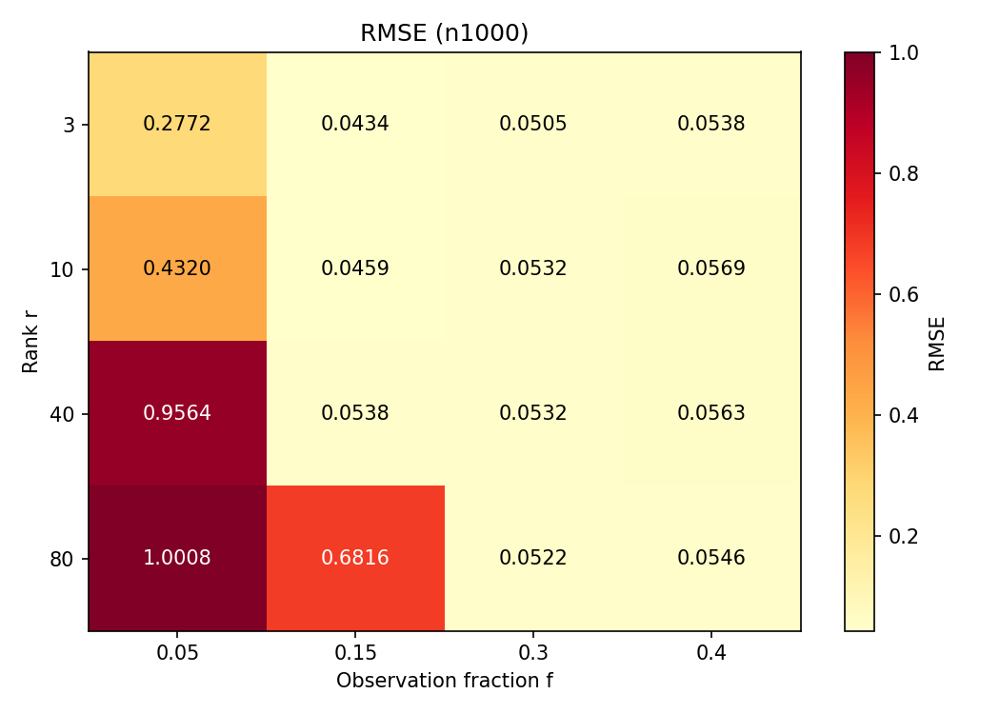
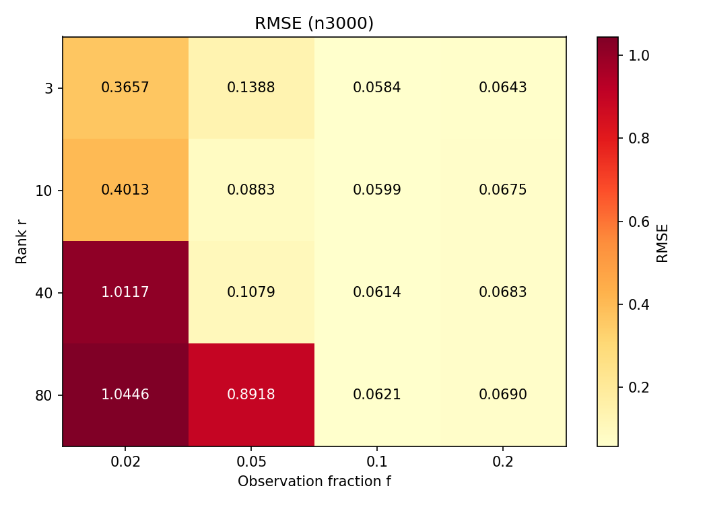
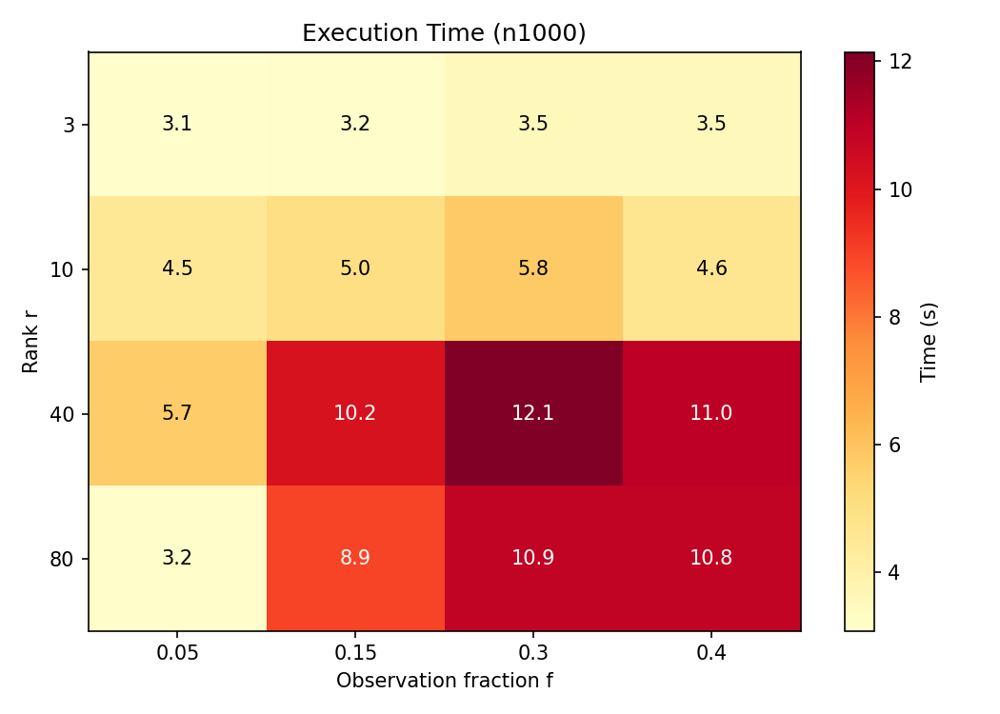
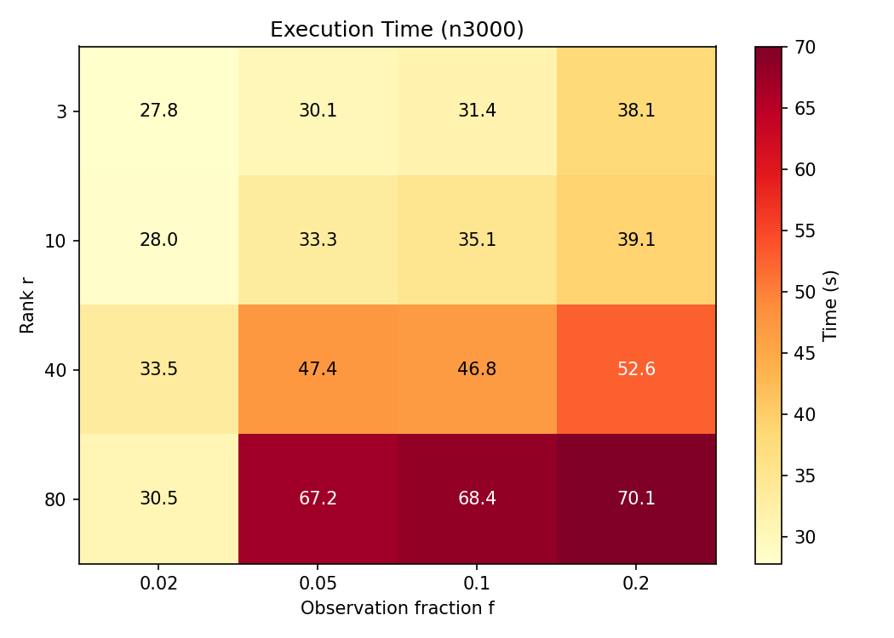

# CS 754 — Advanced Image Processing: HW4

Solutions to Questions 4 and 5 of Assignment 4.

## Question 4: LASSO Variant — Square-Root LASSO

A detailed review of the **Square-Root LASSO** (Belloni, Chernozhukov, Wang, *Biometrika* 2011), including:
- Mathematical formulation with all symbols defined
- Key theorem on pivotal tuning parameter selection
- Advantages over standard LASSO

## Question 5: SVT for Low-Rank Matrix Completion

Implementation of the Singular Value Thresholding (SVT) algorithm via Inexact Augmented Lagrangian Method (IALM) for low-rank matrix completion.

### Experiments

| Setting | Matrix size | Ranks | Observation fractions |
|---------|-------------|-------|-----------------------|
| Exp 1   | 1000×1000   | {3, 10, 40, 80} | {0.05, 0.15, 0.3, 0.4} |
| Exp 2   | 3000×3000   | {3, 10, 40, 80} | {0.02, 0.05, 0.1, 0.2} |

### Results

#### RMSE — n=1000


#### RMSE — n=3000


#### Execution Time — n=1000


#### Execution Time — n=3000


## Files

| File | Description |
|------|-------------|
| `hw4_report.tex` | Full LaTeX report for Q4 and Q5 |
| `svt_matrix_completion.py` | SVT/IALM implementation and experiment runner |
| `plot_results.py` | Script to generate heatmap plots |
| `svt_results.json` | Raw experiment results |
| `rmse_*.png` / `time_*.png` | Result plots |

## How to Run

```bash
# Run all experiments (takes ~1 hour)
python3 svt_matrix_completion.py

# Generate plots from results
python3 plot_results.py
```

### Requirements
- Python 3.8+
- numpy, scipy, scikit-learn, matplotlib
